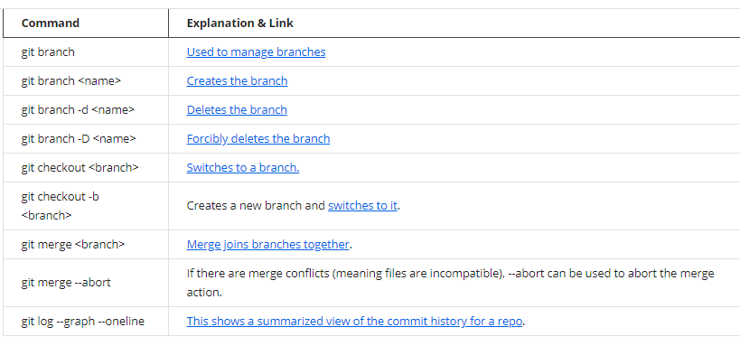

# Branching and Merging

## 🐦 What is Branch?

Branch is a pointer to a particular commit.

2. git **checkout -b branch\_name** &lt;&lt; Create a new branch and immediately switches to it&gt;&gt;

3.git **branch -d** &lt;&lt;To delete  a branch &gt;&gt;

## 🐦 Merging

Combining branch data and history together.

Command : bit **merge** branch\_name 

Two types of merge algorithms : fast forward merge and three way merge

## 🐦 Merge Conflicts

git **log --graph --oneline** &lt;&lt; for better understanding of the history of the comments&gt;&gt;

git **merge --abort** &lt;&lt;It will stop the merge and go back to the previous commit to avoid conflict &gt;&gt;

## 🐦 Summary

